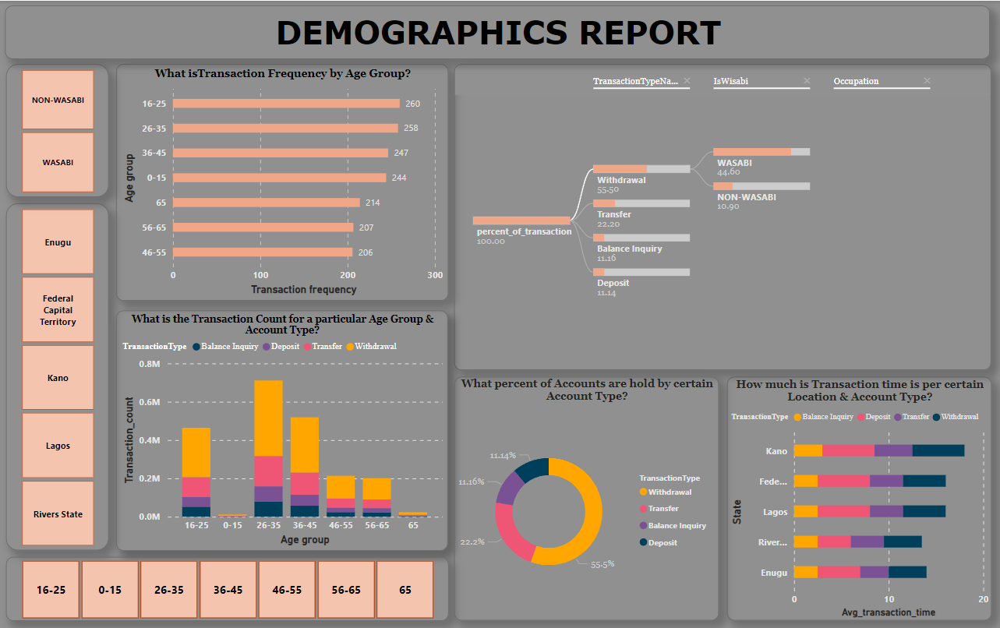

# ATM Analytics Dashboard 📊💳

Welcome to the ATM Analytics Dashboard project – your go-to solution for in-depth analysis of ATM transactions, utilization rates, and geographical distribution. Gain valuable insights into your ATM network's performance and optimize for efficiency.

## Table of Contents
- [Overview](#overview)
- [Installation](#installation)
- [Usage](#usage)
- [Screenshots](#screenshots)
- [Features](#features)
- [Troubleshooting](#troubleshooting)
- [Contributing](#contributing)
- [License](#license)

## Overview 🌐 

The ATM Analytics Dashboard is a Power BI project designed to provide a comprehensive overview of your ATM network's performance. From total transactions to geospatial mapping, this dashboard offers insights that matter.

## Installation 🛠️ 

### Prerequisites
- [Download and install Power BI Desktop](https://powerbi.microsoft.com/desktop/)
- [Optional: Set up Azure Maps for geospatial mapping](https://azure.microsoft.com/en-us/services/azure-maps/)

### Steps
1. Clone the repository or download the Power BI file.
2. Open the Power BI file using Power BI Desktop.
3. Explore the dashboard and visualizations.

## Usage 🚀 

### Dashboard Navigation
- **Overview:** Quick summary of total transactions, amounts, and utilization rates.
- **Transaction Analysis:** Dive into specific transaction types, durations, and frequencies.
- **Geospatial Mapping:** Explore ATM distribution and utilization rates across states.

### Customization
- Utilize filters and slicers for personalized analysis.
- Leverage the scatter plot and decomposition tree for in-depth insights.

### Troubleshooting 🛠️ 

For any issues or inquiries, refer to the "Troubleshooting" section in the README.md file or contact the project maintainers.

## Screenshots 📸 

- **Overview Dashboard:**
  
  

- **Transaction Analysis:**
  
  

- **Geospatial Mapping:**
 
  

## Features 🌟 

- Total transactions and amounts overview.
- Utilization rates calculation for each ATM.
- Geospatial mapping with Azure Maps integration.
- Detailed transaction analysis by type, duration, and frequency.
- Interactive scatter plot for visualizing transaction patterns.

## Contributing 🤝 

We welcome contributions! Follow these steps:
1. Fork the repository.
2. Create a branch (`git checkout -b feature/your-feature`).
3. Commit your changes (`git commit -am 'Add new feature'`).
4. Push to the branch (`git push origin feature/your-feature`).
5. Open a pull request.

## License 📄 

This project is licensed under the [MIT License](LICENSE).
